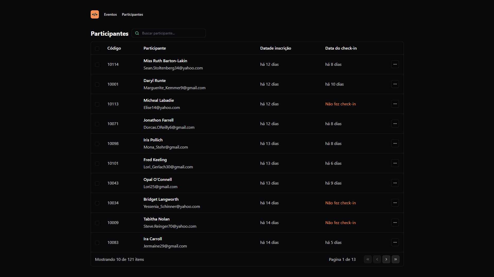
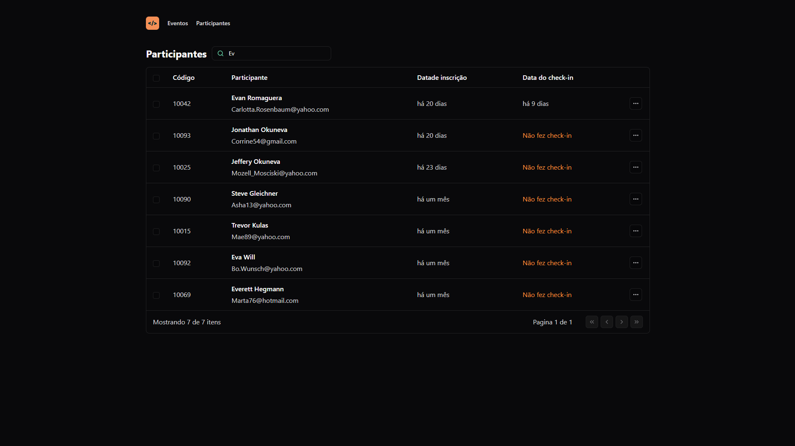

<h1 align="center">Pass in</h1>

<p align="center">
Project developed during the Next Level Week Unite event. <br/>
</p>

<p align="center">
  <a href="#-tecnologias">Technologies</a>&nbsp;&nbsp;&nbsp;|&nbsp;&nbsp;&nbsp;
  <a href="#-project">Project</a>&nbsp;&nbsp;&nbsp;|&nbsp;&nbsp;&nbsp;
  <a href="#-getting-started">Getting started</a>&nbsp;&nbsp;&nbsp;|&nbsp;&nbsp;&nbsp;
  <a href="#-license">License</a>
</p>

<p align="center">
  
  
  
  

</p>

<br>

<p align="center">
  
</p>

### Search by participant

<p align="center">
  
</p>

## 💻 Project

<strong>Pass in</strong> is a platform designed to facilitate the management of events and participants, offering functionalities that enable organizers to register new events, view detailed data of each event, list and query participants, as well as provide a seamless experience for event registration and check-in. All these functionalities have been implemented according to the defined business rules to ensure the effectiveness and usability of the application.


## 🚀 Technologies

This project was developed using the following technologies:

### Web
- [React](https://react.dev/)
- [TypeScript](https://www.typescriptlang.org/)
- [Vite js](https://vitejs.dev/)
- [Lucide React](https://lucide.dev/)
- [Tailwind CSS](https://tailwindcss.com/)
- [Day js](https://www.npmjs.com/package/dayjs)

## Getting started

### Project cloning

```bash
git clone https://github.com/rudyfernandes/nlw-unite-react.git
```

### Web

#### Starting:
```bash
cd pass-in-web
```

```bash
npm install
```

```bash
npm run dev
```

#### Access http://localhost:5173/


## Server

For server usage, it's necessary to install the backend developed in the Node.js track, [click here](https://github.com/rocketseat-education/nlw-unite-nodejs) to see the repository

or

clone the repository.
```bash
git clone https://github.com/rocketseat-education/nlw-unite-nodejs.git
```

#### Starting

```bash
cd nlw-unite-nodejs-main
```

#### Environment variables

```bash
DATABASE_URL="file:./dev.db"
```


```bash
npm install
```

#### For creating tables in Prisma

```bash
npx prisma db seed
```

#### Start:

```bash
npm run dev
```

## 📝 License

This project is licensed under the MIT License. See the [LICENSE](LICENSE) file for more details.
